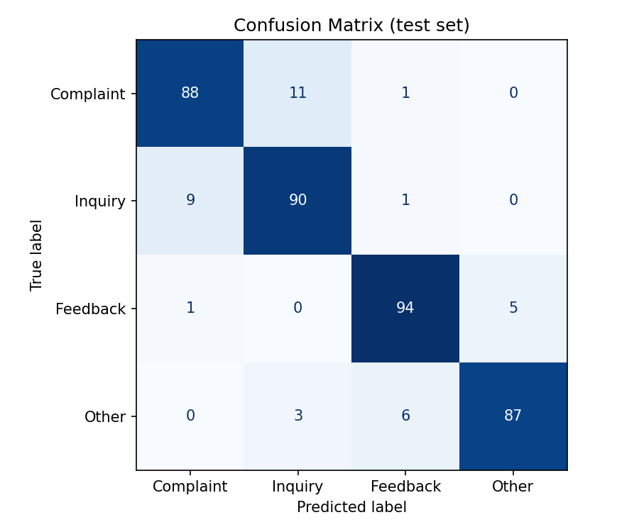
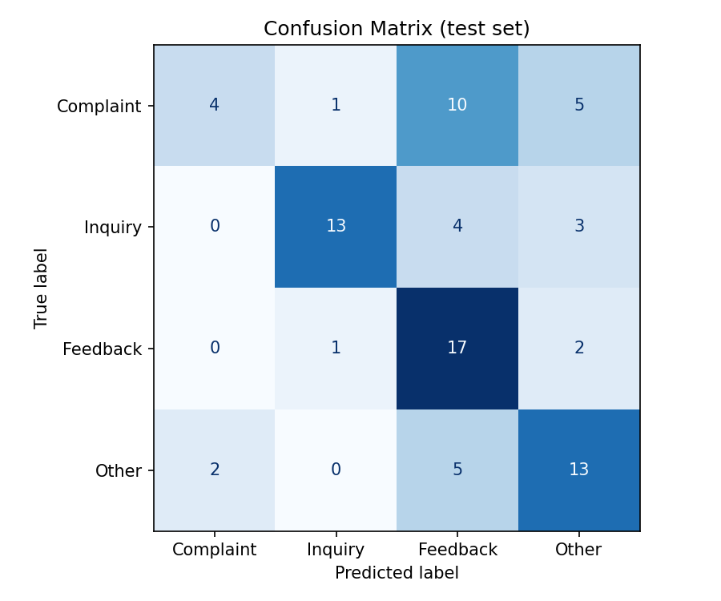

# Smart Text Classifier

A small machine-learning app that classifies short text into one of four categories: **Complaint**, **Inquiry**, **Feedback** or **Other**. It uses TF-IDF features with Logistic Regression (compared against Naive Bayes) and comes with a Streamlit web interface and a command-line tool.

Built for the Varolline Internship Program, Phase 1 (AI Engineer track).

## Features

- Text cleaning pipeline (lowercasing, URL/email removal, punctuation handling that keeps `?`)
- Dataset builder that assembles a labelled dataset from real public sources
- Two models trained and compared with stratified 5-fold cross-validation
- Evaluation with accuracy, macro F1, weighted F1, per-class precision/recall and confusion matrices
- An extra **external test set** of hand-written examples from a different source, to check how well the model generalises
- Streamlit web app with probabilities chart and a low-confidence warning
- Command-line prediction and a demo script with 14 sample predictions
- Unit tests with pytest

## Project structure

```
smart-text-classifier/
├── app/streamlit_app.py        # web interface
├── data/
│   ├── raw/dataset.csv         # training data (built by scripts/build_dataset.py)
│   ├── external_test.csv       # hand-written examples used only for testing
│   └── README.md               # dataset notes
├── models/                     # trained model (created by training, not committed)
├── reports/                    # metrics.json, confusion matrices, sample predictions
├── scripts/
│   ├── build_dataset.py        # downloads and assembles the dataset
│   └── run_samples.py          # demo predictions
├── src/
│   ├── config.py               # paths, labels, random seed
│   ├── preprocess.py           # text cleaning and dataset loading
│   ├── train.py                # training, comparison, saving
│   ├── evaluate.py             # metrics and confusion matrix
│   └── predict.py              # load model and predict (also a CLI)
├── tests/                      # pytest tests
├── requirements.txt
└── README.md
```

## Setup

Requires Python 3.10 or newer.

```bash
git clone https://github.com/Sadiraja/smart-text-classifier.git
cd smart-text-classifier
python -m venv .venv

# Windows
.venv\Scripts\activate
# macOS / Linux
source .venv/bin/activate

pip install -r requirements.txt
```

## Usage

```bash
# 1. (Optional) rebuild the dataset from the public sources (needs internet)
python -m scripts.build_dataset

# 2. Train, evaluate and save the model (writes models/ and reports/)
python -m src.train

# 3a. Web interface
streamlit run app/streamlit_app.py

# 3b. Command line
python -m src.predict "Where is my order?"

# 4. Demo predictions -> reports/sample_predictions.csv
python -m scripts.run_samples

# 5. Tests
pytest
```

The trained model file is not stored in Git because saved scikit-learn models can fail to load across library versions. Always run `python -m src.train` after cloning.

## Dataset

The dataset (about 1,500 rows, 500 per class) is assembled by `scripts/build_dataset.py` from these public sources:

| Class | Source | How it is used |
|---|---|---|
| Complaint | Banking77 (PolyAI, CC BY 4.0) | Customer-service queries whose intent describes a problem (e.g. card not working, declined transfer) |
| Inquiry | Banking77 | Queries whose intent asks for information (e.g. exchange rate, card delivery estimate) |
| Feedback | Amazon Polarity (Apache-2.0) | Short positive product reviews |
| Other | UCI SMS Spam Collection | Ordinary personal text messages and spam |

The mapping from the 77 Banking77 intents to Complaint or Inquiry is my own, done by keyword in `COMPLAINT_KEYWORDS` inside `scripts/build_dataset.py`. More detail is in `data/README.md`.

**External test set:** `data/external_test.csv` holds 80 examples I wrote by hand (20 per class). They are never used for training, so they show how the model behaves on text that does not look like the training sources.

## Approach

1. **Cleaning:** lowercase, remove URLs and emails, strip punctuation but keep `?`, collapse whitespace. Stopwords are kept because short texts depend on words like "not" and "how".
2. **Features:** TF-IDF with unigrams and bigrams, so phrases like "not working" are captured.
3. **Models:** Logistic Regression (balanced class weights) and Multinomial Naive Bayes.
4. **Evaluation:** stratified 80/20 train/test split, plus 5-fold cross-validation on the training portion. The model with the higher macro F1 on the test split is saved.
5. **Generalisation check:** the saved model is also scored on the external hand-written test set.

## Results

Numbers below come from `reports/metrics.json` after running `python -m src.train`.

| Model | Accuracy | Macro F1 | CV macro F1 (mean ± std) |
|---|---|---|---|
| Logistic Regression | `0.9066` | `0.9069` | `0.9067` |
| Naive Bayes | `0.8889` | `0.8881` | `0.8883` |

Selected model: `logistic_regression`

| Test set | Examples | Accuracy | Macro F1 |
|---|---|---|---|
| Standard test split | `1583` | `0.9066` | `0.9069` |




`<FILL: 2-3 sentences. Why the two scores differ and which classes get confused.>`

## Sample predictions

14 demo predictions are in `reports/sample_predictions.csv` (created by `python -m scripts.run_samples`).

`<FILL: paste the table from the script output, and note which predictions were wrong and why.>`

## Limitations

- Each class comes from a different source, so the model can partly learn the *style* of a source (SMS slang, review tone, banking wording) instead of the category itself. The standard test score is therefore optimistic.
- Feedback contains only positive reviews, so suggestions like "please add dark mode" are often misclassified.
- The Complaint/Inquiry labels come from a keyword mapping, so some examples are noisy (a "complaint" can be phrased as a question).
- English only. Sarcasm, mixed-intent messages and Roman Urdu are not handled.
- Very short or unusual texts get low-confidence predictions.

## Future improvements

- Collect real, single-domain data with labels for all four classes, including neutral and negative feedback and suggestions.
- Replace TF-IDF with sentence embeddings or fine-tune a small transformer model.
- Add an "Unsure" outcome using a confidence threshold, and route those texts for human review.
- Add multilingual support (Urdu / Roman Urdu).

## Acknowledgements

- Banking77: Casanueva et al., *Efficient Intent Detection with Dual Sentence Encoders*, 2020.
- Amazon Polarity: McAuley and Leskovec, 2013; Zhang et al., 2015.
- UCI SMS Spam Collection: Almeida and Hidalgo.
- Libraries: scikit-learn, pandas, Streamlit, matplotlib, joblib, pytest.
- AI tools (Claude) assisted with code and documentation. I reviewed, tested and can explain all of it.